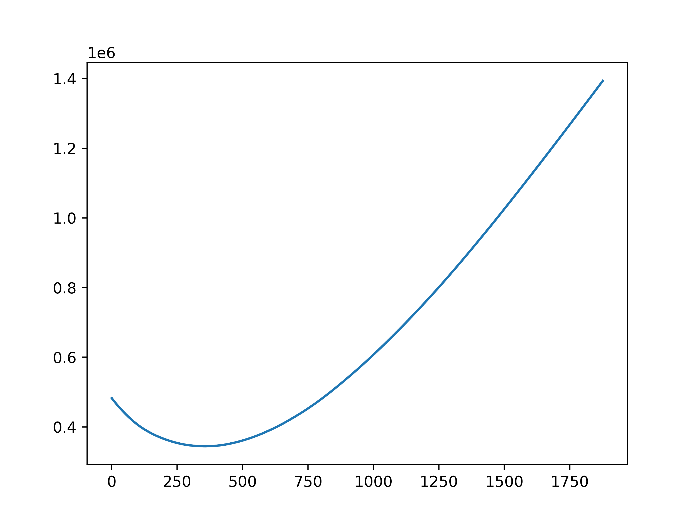
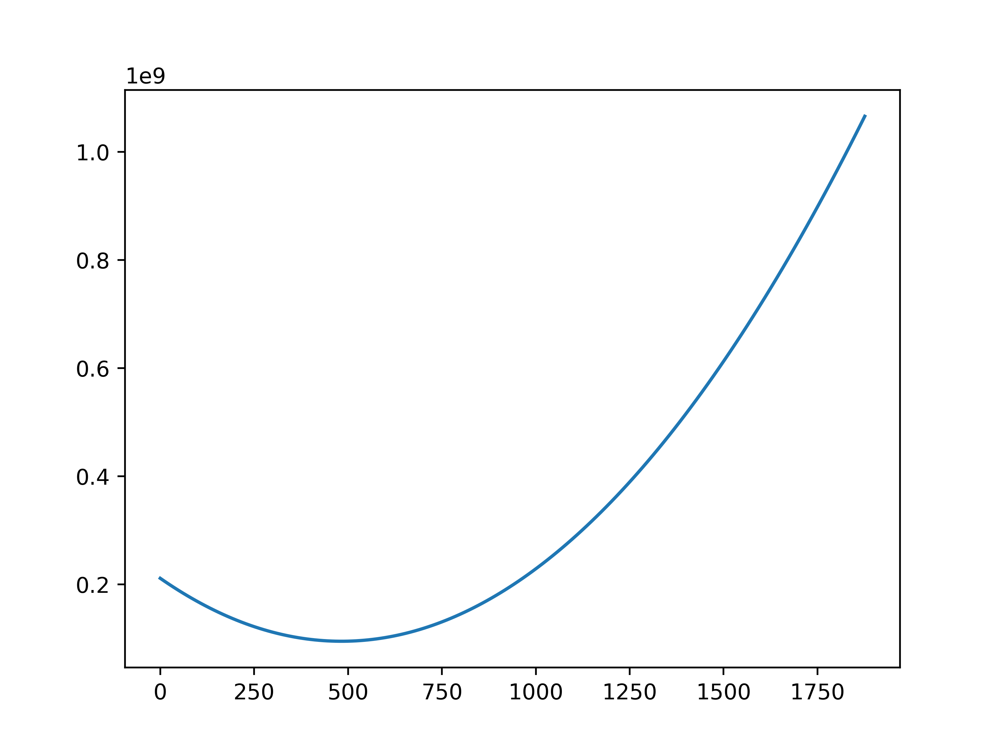

# Problem

Part 1: Calculate the total cost of moving from position one to position two for all entities where each step is 1.

Part 2: Same as above but the cost is now N + 1 for each step

# Solution
Each entity costs the same amount to move if it is in the same starting location so construct a dict of the number of entities and the starting location
Calculate the cost for each location to move to the final location
Times the cost by the number of entities
Sum all the costs for each starting location.

This results in a curve of final location and costs.

# Part 1
Final cost = 344138

# Part 2
Final cost = 94862124

